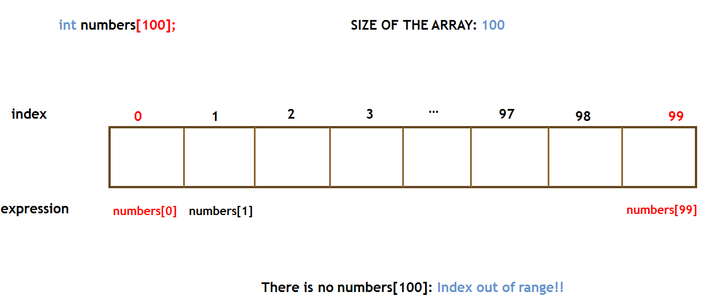
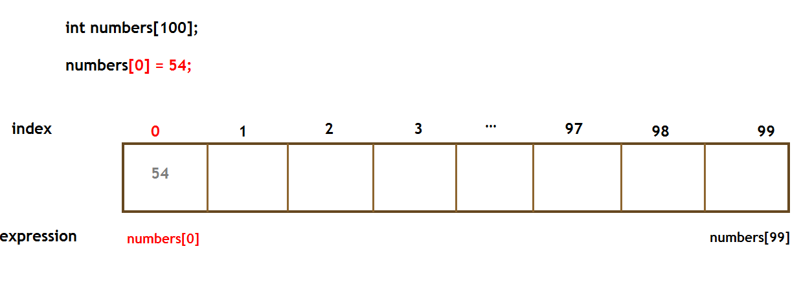
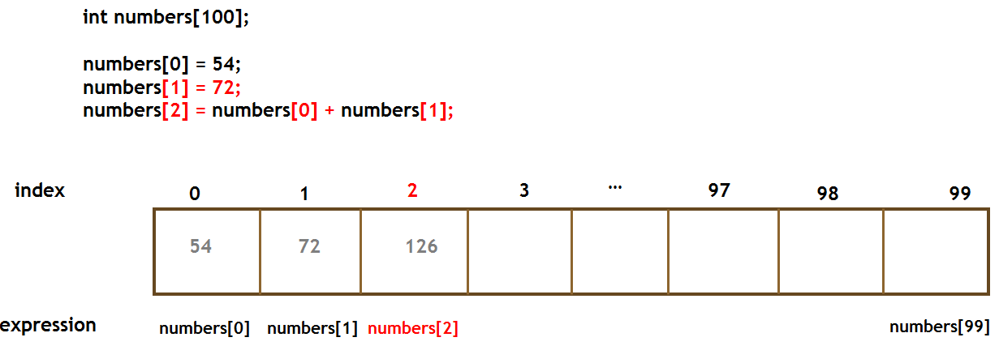

# Week 10 Notes - 27.11.2019

### Question 1 - Reverse (Lab7 - Q2)

Write a program which reads an integer N from the user, then reads N integers from the user. Then your program should put these N integers into reverse order in the array and print the array to the screen. Assume N is smaller than 50.

|  INPUT  |  OUTPUT |
|-------|-------|
| 8 1 2 4 3 5 6 8 7 | 7 8 6 5 3 4 2 1 |

 

### Question 2 - Let's Count

Write a program which reads an integer N from the user, then reads N integers from the user to an array. Then find frequency of each element in the array. Assume N is smaller than 1000 and the entered numbers will be between 0 and 100 (inclusive).

|  INPUT  |  OUTPUT |
|-------|-------|
| 10 5 10 2 5 50 5 10 1 2 2 | 1 --> 1 2 --> 3 5 --> 3 10 --> 2 50 --> 1 |

 

### Question 3 - fix34

Write a program which reads an integer N from the user, then reads N integers from the user to an array. Then modify the array so that it contains exactly the same numbers as the given array, but rearranged so that every 3 is immeddiately followed by a 4. Do not move the 3's, but every other number may move. The array contains the smae number of 3's and 4's, every 3 has number after it that is not a 3, and a 3 appears in the array before any 4.

|  INPUT  |  OUTPUT |
|-------|-------|
| 4 1 3 1 4 | 1 3 4 1 |
| 7 1 3 1 4 4 3 1 | 1 3 4 1 1 3 4 |
| 4 3 2 2 4 | 3 4 2 2 |

 

### Question 4 - Bubble Sort

Write a program which reads an integer N from the user, then reads N integers from the user to an array. Then sort elements of the array in ascending order. 

|  INPUT  |  OUTPUT |
|-------|-------|
| 8 4 2 8 6 7 3 1 5 | 1 2 3 4 5 6 7 8 |

Bubble Sort is the simplest sorting algorithm that works by repeatedly swapping the adjacent elements if they are in wrong order.

Example:

First Pass:
* ( **5** **1** 4 2 8 ) –> ( **1** **5** 4 2 8 ), Here, algorithm compares the first two elements, and swaps since 5 > 1.
* ( 1 **5** **4** 2 8 ) –> ( 1 **4** **5** 2 8 ), Swap since 5 > 4
* ( 1 4 **5** **2** 8 ) –> ( 1 4 **2** **5** 8 ), Swap since 5 > 2
* ( 1 4 2 **5** **8** ) –> ( 1 4 2 **5** **8** ), Now, since these elements are already in order (8 > 5), algorithm does not swap them.

Second Pass:
* ( **1** **4** 2 5 8 ) –> ( **1** **4** 2 5 8 )
* ( 1 **4** **2** 5 8 ) –> ( 1 **2** **4** 5 8 ), Swap since 4 > 2
* ( 1 2 **4** **5** 8 ) –> ( 1 2 **4** **5** 8 )
* ( 1 2 4 **5** **8** ) –> ( 1 2 4 **5** **8** )

Now, the array is already sorted, but our algorithm does not know if it is completed. The algorithm needs one whole pass without any swap to know it is sorted.

Third Pass:
* ( **1** **2** 4 5 8 ) –> ( **1** **2** 4 5 8 )
* ( 1 **2** **4** 5 8 ) –> ( 1 **2** **4** 5 8 )
* ( 1 2 **4** **5** 8 ) –> ( 1 2 **4** **5** 8 )
* ( 1 2 4 **5** **8** ) –> ( 1 2 4 **5** **8** )

 

### Question 5 - Pairs

Write a program which reads an integer N and an integer X from the user, then reads N integers from the user to an array. Then find all pairs in the array whose sum is equal to X. 

* (3,3) is not a valid pair for 6
* You can print either (3,4) or (4,3) for one pair.
* You should print all the pairs even if they are same.

|  INPUT  |  OUTPUT |
|-------|-------|
| 7 7 2 4 3 5 7 8 9 | (2, 5) (4, 3) |
| 10 7 2 4 3 5 6 -2 4 7 8 9 | (2, 5) (4, 3) (3, 4) (-2, 9) |